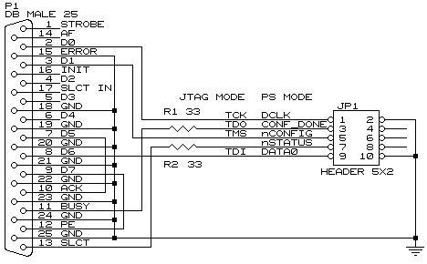
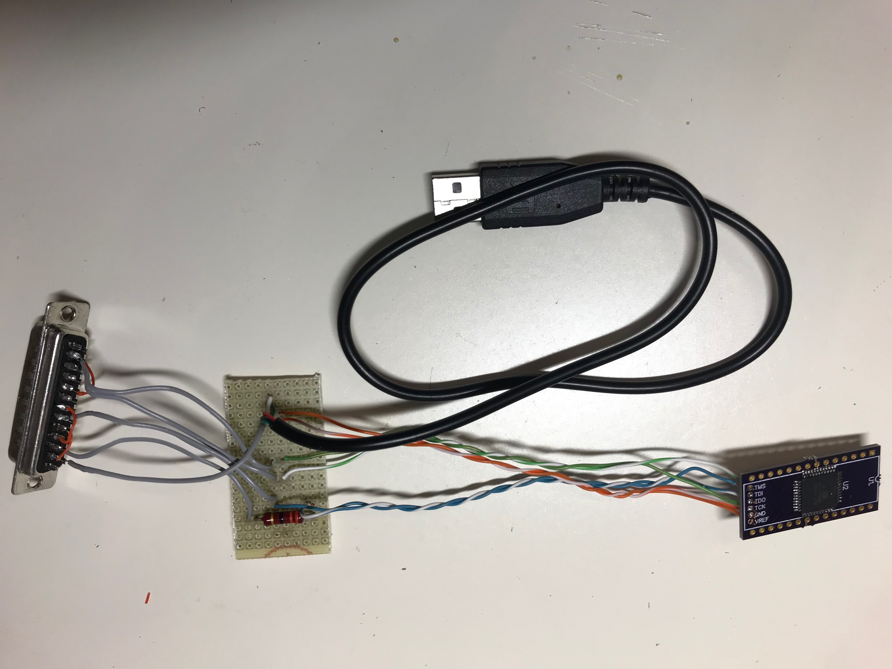
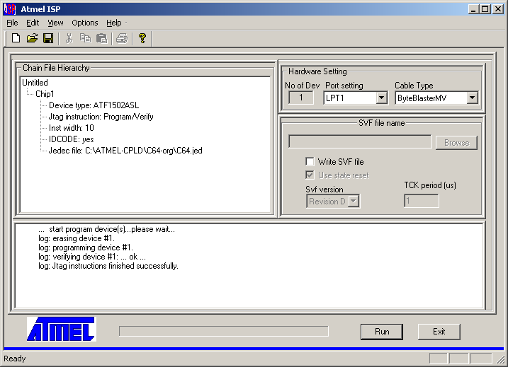

# 82S100replacement
A CPLD implementation of the classic 82S100/82S101 as used in for example C64

The WinCUPL code is taken directly from the [VHDL](https://bitbucket.org/skoe/pla) made by Thomas 'skoe' Giesel and simply translated into WinCUPL. Skoe made an excellent [description](http://skoe.de/docs/c64-dissected/pla/c64_pla_dissected_r1.1_a4ds.pdf) on the C64 PLA which is very well worth reading.

The small board is available as a shared project at [OSHPark](https://oshpark.com/shared_projects/fJN4h1Z9). Anyone is welcome to use the production files, Diptrace files and WinCUPL the way they like. But don't blame me if you get problems (or destroy your computer or someone else's computer...). It works fine for me and your mileage may vary.

Yes. I am aware that I did a small mistake in that the JTAG connector doesn't have 0.1" pitch.

Compared with other C64 PLA replacements this one is more generic 82S100 or 82S101 replacement since the #OE signal is provided at pin 19 and there is no special buffering on the outputs so they can be either tristate or open collector as the designer of the WinCUPL file wishes.

The CPLD used is an Atmel ATF1502ASL-25AU44. The good thing with this Atmel part is that it is 5V. Not just 5V tolerant. The L variant is also Low power and the slowest part which is good when emulating old parts. Mouser order# [556-AF1502ASL25AU44](http://www.mouser.se/Search/ProductDetail.aspx?R=ATF1502ASL-25AU44). The decoupling capacitor is a 0.22uF ceramic. Mouser order# [80-C0805C224K5R](http://www.mouser.se/Search/ProductDetail.aspx?R=C0805C224K5RACTU). The cheapest way to get the connecting pins is to order them from Aliexpress. Search for ["Gold Plated 2.54mm Male 40 Pin Single Row Straight Round Pin Header Strip"](https://www.aliexpress.com/af/Gold-Plated-2.54mm-Male-40-Pin-Single-Row-Straight.html?ltype=wholesale&d=y&origin=n&isViewCP=y&catId=0&initiative_id=SB_20161201120954&SearchText=Gold+Plated+2.54mm+Male+40+Pin+Single+Row+Straight&blanktest=0)

Since Xilinx XC9536 and EPM7032S is pin compatible they can be used as far as I can see. However both these vendors has discontinued their 5V lines. Althoug devices can probably be found from surplus sellers.

To program the part you need to download the WinCUPL software fomr Atmel site. It is free and runs under Windows. Then to download your design to the chip you need a JTAG ISP cable, ATDH1150USB-K.

["jamarju"](https://github.com/jamarju) contributed with information on a cheaper way to program the Atmel devices:

As an alternative, if you have an old computer with LPT1, you can build this cable:

I used a cut out USB cable to get the 5V for VREF and tied the DB-25 and USB GNDs together. Also pin 13 out of the DB-25 is not needed, so the only components needed are 1x 33 ohm and 1x DB-25 male connector.

Use the older XP/2000 [ATMISP v6.7](http://www.atmel.com/tools/atmisp.aspx) version and choose "ByteBlasterMV" as programmer:

